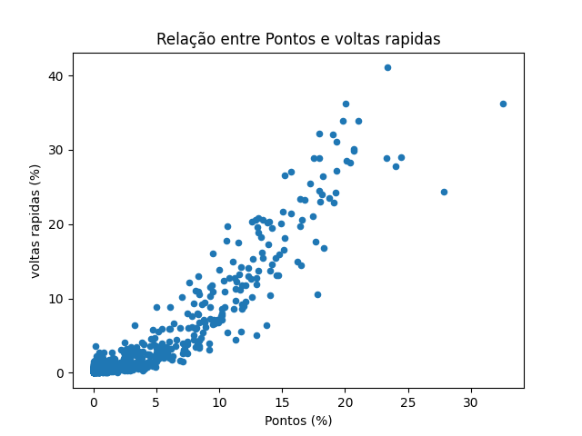

Hipótese1 - relatorio
=====================

Após a implementação das funções que limpam os dados e a passagem por todos os anos com dados disponíveis, identifiquei três momentos em que a função apresentava erros relacionados a pilotos não incluídos no resultado final do campeonato.

Tratamento de Erros
-------------------

Para lidar com essa situação, criei uma função que, ao ser chamada, recebe os IDs do piloto e da corrida, imprimindo na tela o nome do piloto, ano, rodada e nome da corrida. Essa função é sempre chamada dentro de um bloco `try-except`, que tenta adicionar mais um a um índice. Caso não consiga encontrar esse índice, a função de tratamento de erros é acionada.

.. code-block:: python

   try:
      final.loc[piloto] += 1
   except:
      find_driver_track_err(int(piloto), int(track))

Esses erros se deviam a pilotos que correram apenas uma corrida na temporada, e nem terminaram as corridas em que participaram, logo a melhor opção foi ignorar
continuando a rodar o código, já na parte de plotar o grafico, cheguei ao seguinte grafico

buscando sobre o tema na internet, existiram duas mudanças no sistema de pontuação no ano de 2003 (que não agregou muita diferença na faixa) e em 2010 (que gerou a diferença entre as duas faixas)

para resolver isso, crio o gráfico como a porcentagem de voltas e pontos que cada piloto conseguiu em um determinado ano, desse modo

Análise e considerações finais
------------------------------

Com o código já feito e certo, ficamos com o seguinte gráfico

podemos ver que aparentemente existe correlação entre voltas mais rápidas e pontuação, geralmente, o piloto mais rápido tende a ser o campeão, não sendo uma regra

   
Hipótese1 - documentação
========================

.. currentmodule:: hipotese1

Documentação do módulo hipotese1.

.. automodule:: hipotese1
   :members:
   :undoc-members:
   :show-inheritance:

