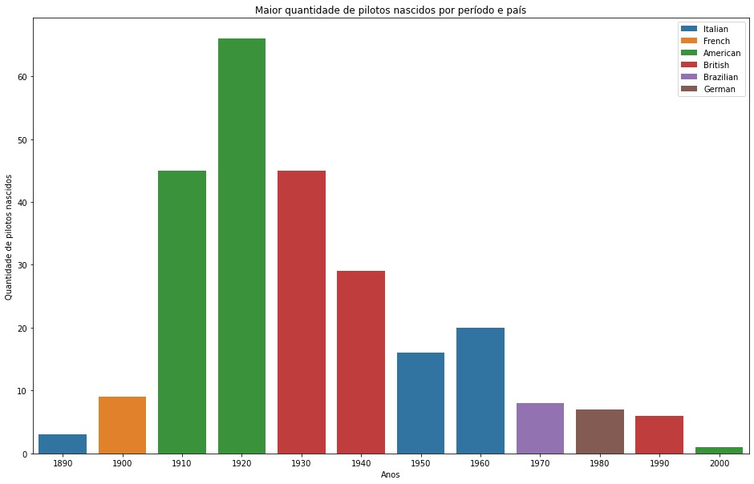
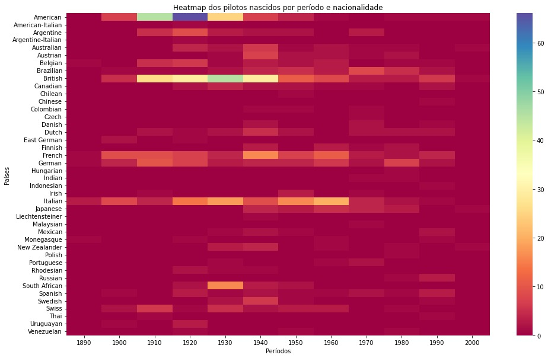

Hipótese3 - relatorio
=====================

Hipótese proposta
-----------------
O principal problema a ser respondido pela análise consiste no seguinte:

Em quais países nasceram mais pilotos em cada intervalo de tempo, tomando uma base de 10 em 10 anos?

Embora essa seja a questão principal, ela ainda responde indiretamente outras duas secundárias também interessantes:

Em quais países nasceram mais pilotos?
Em quais períodos nasceram mais pilotos?
Abordando cada um isoladamente agora.

Pré-processamento dos dados
---------------------------

O pré-processamento dos dados foi um tanto simples e contou com três partes:

Remoção de dados inúteis para a análise do CSV “drivers.csv”, deixando apenas as colunas “nationality” e “dob” (day of birth).

Categorização de cada entrada da coluna “dob” em períodos de tempo (no código, os períodos são ajustáveis conforme o parâmetro passado).

Disposição dessas duas colunas em um dataframe em forma de tabela, com linhas representando cada nacionalidade e colunas representando os períodos.

Cada entrada desse dataframe reflete a quantidade de pilotos de cada nacionalidade nascidos em cada intervalo posto.

Resultados da análise exploratória
----------------------------------
Tão simples quanto o processamento, a análise exploratória se resumiu à elaboração de dois gráficos:

Um heatmap para visualizar a tabela como um todo.

Um gráfico de barras para indicar a maior quantidade de pilotos por cada período e país.

Além disso, foram elaboradas duas séries que descrevem:

O nascimento máximo por período.
O nascimento máximo por país.

Validação das hipóteses
-----------------------

Os gráficos permitem concluir de maneira inequívoca que as nacionalidades que mais nasceram pilotos são:

Americanos
Britânicos
Italianos

Com os maiores períodos de nascimento entre:

1910-1930
1930-1950
1950-1970, respectivamente.
Obviamente, há campeões de nascimento para cada período, mas esses três são os que mais se destacam.

Além disso, o heatmap ainda permite concluir que, em geral, as nacionalidades da maioria dos pilotos ao longo da história são esses mesmos países e que o período em que nasceram mais pilotos é a faixa de 1910 até 1940.

Desafios encontrados
--------------------

Os maiores desafios encarados na análise, sem sombra de dúvida, foram:

Tratamentos de erro
Documentação
Embora sejam importantes para trabalhos maiores e coletivos, não são o tipo de prática comumente encontrada ao fazer códigos pequenos ou para si mesmo.

Devido a essa ausência de prática, realizar essa parte foi excepcionalmente desafiador.

Hipótese3 - documentação
========================

.. currentmodule:: hipotese3

Documentação do módulo hipotese3.

.. automodule:: hipotese3
   :members:
   :undoc-members:
   :show-inheritance:
